# Описание проекта
Проект представляет собой backend-составляющую cистему аутентификации и авторизации. Основной задачей разработки 
является продумывание и предложение собственной системы доступа к ресурсам.

## Используемые инструменты
* **Python** (3.12);
* **Django** (бесплатный веб-фреймворк для языка Python);

## Сборка и запуск приложения

1. Скачиваем содержимое репозитория в отдельную папку:
    ```
    git clone ssh://git@github.com:serij-pa/The_Effective_Mobile_app.git
    ```
   
2. Переходим в директорию The_Effective_Mobile_app.
   Создаем виртуальное окружение:    
    ```
    python -m venv .venv
    ```

3. В директорию The_Effective_Mobile_app копируем requirements.txt и устанавливаем зависимости:
    ```
    pip istall -r requirements.txt
    ```

4. Создаем django-проект: 
    ```
    python -m django startproject backend
    ```
   (ну или другое имя проекту заменив backend)

5. Выполняем миграции:   
    ```
    python manage.py migrate
    ```
   
6. Запускаем тестовый сервер:
    ```
    python manage.py runserver
    ```

## Основные модули системы
### 1. Взаимодействие с пользователем
Позволяет пользователям регистрироваться, входить в систему, выходить из учетной записи, обновлять свои данные и удалять аккаунт.
* Регистрация: Ввод имени, фамилии, отчества, email, пароля, повтор пароля.

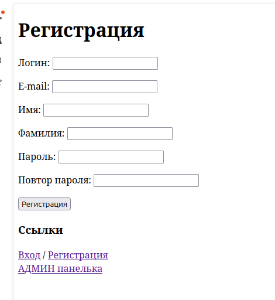

* Обновление информации: 
* Пользователь может редактировать свой профиль как изменение аватарки так и всю информацию.

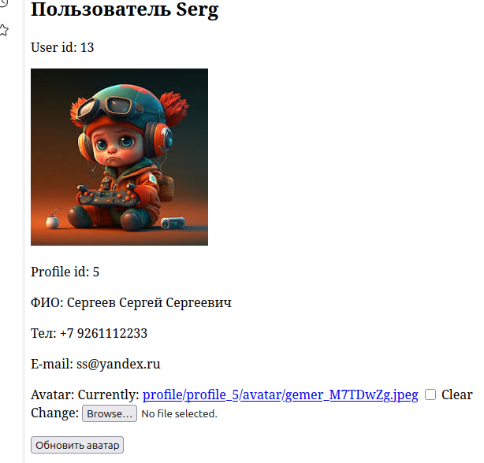 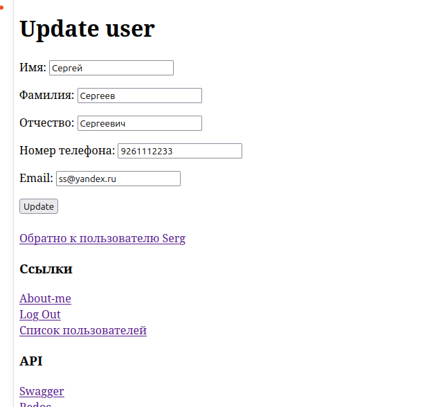

* Мягкое удаление пользователя утем изменения is_active на False

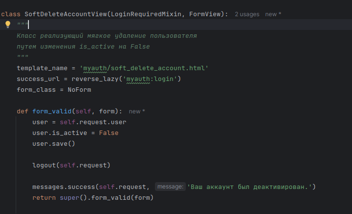

* Login: пользователь входить в систему по email и паролю.
* Реализованы оба бэкенда: и по логину и по E-mail

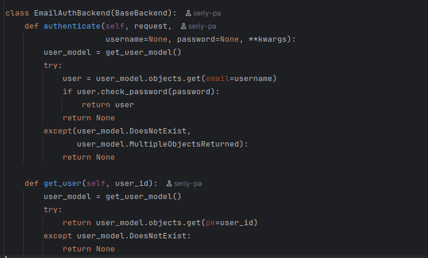

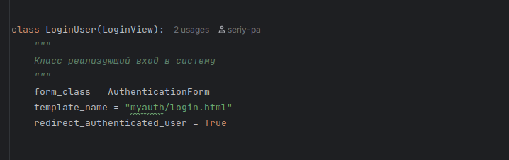

* Logout: пользователь выходит из системы.

### 2. Система разграничения прав доступа. 

* В самих шаблонах стоит проверка на аутентификацию 

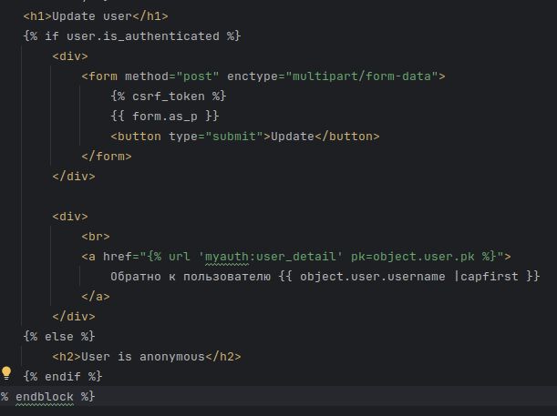

* В классах подключены механизмы контроля доступа к ресурсам

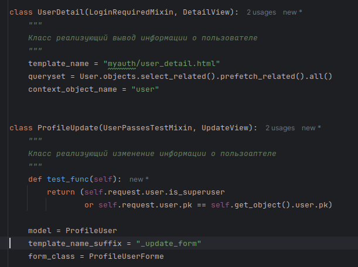

* Для удобства изменения данных АДМИНОМ выгружается список всех пользователей с возможностью изменения профиля.


* Вносить изменения в профиль могут или Админ или сам пользователь кому принадлежить профиль.

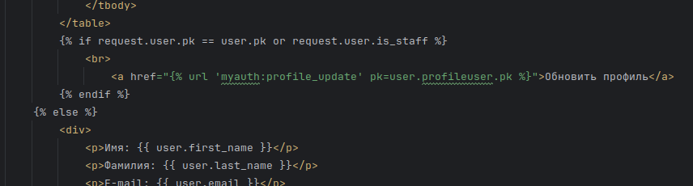

* Если пользователь определен, но запрашиваемый ресурс ему не доступен то


* Реализовано API с возможностью получения и изменения этих правил пользователю.
* Первый вариант через API самого пользоватедя путем добавления ему необходимых прав

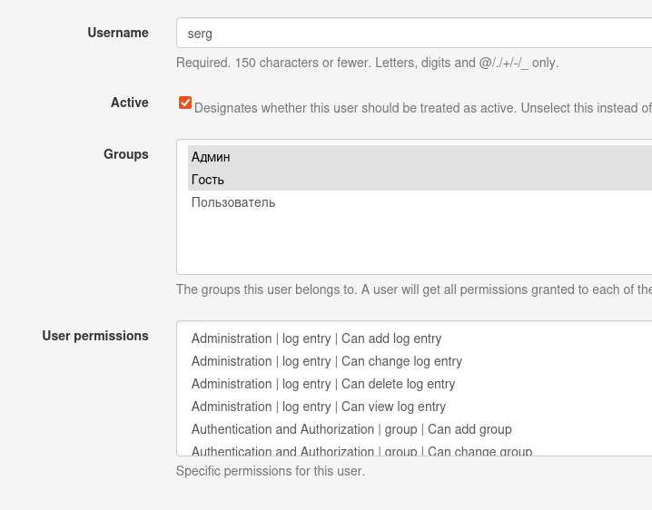

* Второй вариант через API группы путем добавления пользователя в группу и добавления группе необходимых прав

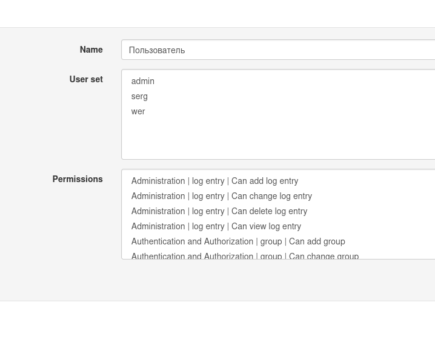

* Третий вариант через Swagger или Redoc

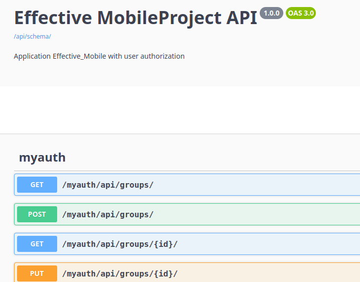

